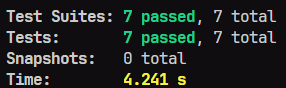

## Lacrei Saúde

Esse projeto envolve a criação de um site para o desafio técnico da ONG Lacrei Saúde, sendo uma aplicação responsiva e seguindo as melhores práticas eu me desafiei para reproduzir ao máximo meus conhecimentos.

## Tecnologias utilizadas:

- NextJs 🌐
- Typescript 🟦
- Jest 🧪
- React Testing Library 🦉
- Styled-components 💅

## Como rodar o projeto:

1- Clone o Projeto

```bash
git clone https://github.com/NathanRodriguesVieira99/Lacrei-Saude.git
```

2- Instale as dependências

```bash
pnpm add
```

3- Entre na pasta do projeto

```bash
cd lacrei-saude
```

4- Rode o projeto

```bash
pnpm dev
```

## 🚀 Build e Deploy:

O projeto está configurado para o deploy automático na **Vercel**. Siga instruções para realizar o build e o deploy.

### **Build do Projeto**

Para gerar a versão de produção, execute o seguinte comando:

```bash
pnpm run build
```

## Deploy na Vercel:

O deploy foi configurado para ser feito automaticamente pela Vercel:

1- instalar a CLI da Vercel

```bash
pnpm add vercel
ou
npm i -g vercel
```

2-Fazer o login

```bash
 vercel login
```

3- Executar o deploy

```bash
 vercel
```

4- Agora é só seguir as instruções

## 🔎 Link de acesso ao projeto

https://lacrei-saude-ten.vercel.app/Inicio

## 🧪 Cobertura de testes


